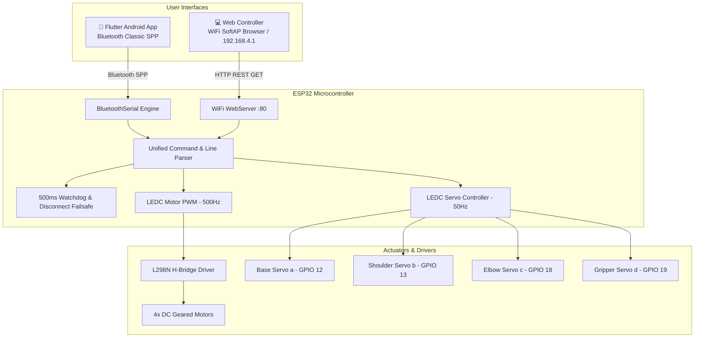

# 🤖 Fresco — RampBot ESP32 Robotics & Dual-Control Platform

[](https://www.espressif.com/)
[](https://flutter.dev/)
[](https://github.com/sadmsd707/fresco)
[](LICENSE)

**Fresco (RampBot)** is an end-to-end robotics control platform combining high-torque **ESP32 firmware**, an immersive **Flutter mobile application** (Bluetooth SPP), and a responsive **HTML5/JS Web Controller** (WiFi SoftAP). It is engineered for 4WD robotic rovers equipped with a 4-degree-of-freedom (4-DOF) robotic arm and gripper.

---

## 📑 Table of Contents

- [Key Features](#-key-features)
- [System Architecture](#-system-architecture)
- [Hardware & Pinout Specification](#-hardware--pinout-specification)
- [Communication Protocol](#-communication-protocol)
- [Firmware Overview (ESP32)](#-firmware-overview-esp32)
- [Flutter Mobile Controller](#-flutter-mobile-controller)
- [Web Controller Interface](#-web-controller-interface)
- [Getting Started](#-getting-started)
  - [1. ESP32 Flashing Guide](#1-esp32-flashing-guide)
  - [2. Flutter App Setup](#2-flutter-app-setup)
  - [3. Web Controller Setup](#3-web-controller-setup)
- [Repository Structure](#-repository-structure)
- [Troubleshooting & Best Practices](#-troubleshooting--best-practices)

---

## ⚡ Key Features

- **Dual-Mode Connectivity**:
  - **Bluetooth Classic SPP**: Low-latency direct serial link with phone.
  - **WiFi SoftAP + Embedded Web Server**: Direct connection via browser (`http://192.168.4.1`) with zero app installation.
- **High-Torque Motor Control Engine**:
  - Optimized 500 Hz PWM frequency for L298N drivers to minimize transistor switching loss.
  - Initial 200 ms dynamic kick-pulse (255 PWM) to overcome static inertia under heavy payload.
  - Configurable minimum duty threshold (120 PWM) to eliminate dead-band motor stall.
- **4-DOF Robotic Arm Control**:
  - Non-blocking smooth servo interpolation engine (10° / 8 ms step rate).
  - Dual touch-joysticks supporting continuous **Jog Rate Mode** and **Direct Position Mode**.
  - Micro-trim angle buttons ($\pm 5^\circ$) and instant Gripper Open/Close macros.
  - One-touch Home preset pose ($90^\circ$ calibration).
- **Safety & Failsafe Watchdogs**:
  - Automatic motor cutoff on Bluetooth disconnect.
  - 500 ms active command watchdog timer to prevent runaway rovers during signal drops.

---

## 🏗 System Architecture



---

## 🔌 Hardware & Pinout Specification

### DC Motor Driver (L298N)
| L298N Pin | ESP32 GPIO | Description |
| :--- | :--- | :--- |
| **ENA** | `GPIO 14` | Left Motors PWM Speed Enable |
| **IN1** | `GPIO 26` | Left Motors Direction A |
| **IN2** | `GPIO 27` | Left Motors Direction B |
| **ENB** | `GPIO 32` | Right Motors PWM Speed Enable |
| **IN3** | `GPIO 25` | Right Motors Direction A |
| **IN4** | `GPIO 33` | Right Motors Direction B |

### 4-DOF Robotic Arm Servos
| Channel | Servo Joint | ESP32 GPIO | Operating Range | Home Angle |
| :--- | :--- | :--- | :--- | :--- |
| **a** | Base Rotation | `GPIO 12` | $0^\circ - 180^\circ$ | $90^\circ$ |
| **b** | Shoulder | `GPIO 13` | $0^\circ - 180^\circ$ | $90^\circ$ |
| **c** | Elbow | `GPIO 18` | $0^\circ - 180^\circ$ | $90^\circ$ |
| **d** | Gripper | `GPIO 19` | $0^\circ - 180^\circ$ | $90^\circ$ |

> [!WARNING]
> **Power Supply Separation**: Servos require substantial peak current. Power them from a dedicated 5V–6V external UBEC / buck converter. **Join all ground lines (GND)** between the ESP32, L298N, and servo power supply. Do NOT power servos directly from the ESP32 5V/3.3V pins.

---

## 📡 Communication Protocol

### 1. Drive Commands (Single Char)
Sent continuously or on event trigger without line termination:
- `F` : Move Forward
- `B` : Move Backward
- `L` : Pivot / Spin Left
- `R` : Pivot / Spin Right
- `G` : Diagonal Forward-Left
- `I` : Diagonal Forward-Right
- `H` : Diagonal Backward-Left
- `J` : Diagonal Backward-Right
- `S` : Emergency / Active Stop
- `0`–`9` : Set Speed ($100$ to $253$ PWM)
- `q` : Full Speed ($255$ PWM)

### 2. Arm & Joystick Line Commands (Terminated by `\n` or `#`)
- `a<0-180>\n` : Set Base Servo Angle (e.g., `a90`)
- `b<0-180>\n` : Set Shoulder Servo Angle (e.g., `b45`)
- `c<0-180>\n` : Set Elbow Servo Angle (e.g., `c120`)
- `d<0-180>\n` : Set Gripper Servo Angle (e.g., `d30` for open, `d150` for close)
- `j<x>,<y>\n` : XY Joystick Drive Vector (e.g., `j-40,100` where $x = \text{turn}$, $y = \text{throttle}$)
- `P` : Reset Arm to Home Pose ($90^\circ$ all joints)

---

## ⚙ Firmware Overview (ESP32)

Located in [`esp32_firmware/robot_controller/robot_controller.ino`](file:///esp32_firmware/robot_controller/robot_controller.ino):
- **Core LEDC Timers**: Configured with independent channels for motors (500 Hz, 8-bit) and servos (50 Hz, 16-bit).
- **WiFi SoftAP**:
  - **SSID**: `RampBot-WiFi`
  - **Password**: `rampbot123`
  - **IP Address**: `192.168.4.1`
- **Embedded Web Server**: Serves a complete interactive control web interface directly from ESP32 PROGMEM flash memory.

---

## 📱 Flutter Mobile Controller

Located in [`lib/`](file:///lib/):
- **Landscape Immersive Cyberpunk UI**: Designed with glassmorphism, glowing telemetry badges, and high-contrast indicators.
- **D-Pad Drive Controller**: Multi-touch 8-direction control with hold-to-drive repeat pulses.
- **Dual Joystick Controls**:
  - **Joystick 1**: Controls Base ($X$-axis) and Shoulder ($Y$-axis).
  - **Joystick 2**: Controls Elbow ($X$-axis) and Gripper ($Y$-axis).
- **Jogging Engine**: Interpolates angles smoothly at $120^\circ/\text{sec}$ when joysticks are deflected.

---

## 🌐 Web Controller Interface

Located in [`web_controller/index.html`](file:///web_controller/index.html):
- Responsive desktop and mobile layout with dark glassmorphism styling.
- Keyboard navigation: `W`/`A`/`S`/`D` or Arrow Keys for driving, `Space` to stop.
- Live servo angle feedback sliders and real-time command execution log.

---

## 🚀 Getting Started

### 1. ESP32 Flashing Guide
1. Open the **Arduino IDE** (or VS Code with Arduino extension).
2. Install the **ESP32 Board Package** (by Espressif) via Boards Manager.
3. Select **ESP32 Dev Module**.
4. Open [`esp32_firmware/robot_controller/robot_controller.ino`](file:///esp32_firmware/robot_controller/robot_controller.ino).
5. Connect your ESP32 via USB and click **Upload**.

### 2. Flutter App Setup
1. Ensure Flutter 3.x+ is installed:
   ```bash
   flutter --version
   ```
2. Fetch dependencies:
   ```bash
   flutter pub get
   ```
3. Connect your Android device and run:
   ```bash
   flutter run --release
   ```
4. Pair with the Bluetooth device named `RampBot` in Android settings, open the app, and connect.

### 3. Web Controller Setup
1. Power on the ESP32.
2. Connect your computer or phone to the WiFi network:
   - **SSID**: `RampBot-WiFi`
   - **Password**: `rampbot123`
3. Open your browser and navigate to:
   ```
   http://192.168.4.1
   ```

---

## 📁 Repository Structure

```plaintext
fresco/
├── android/                   # Android native project & manifest configurations
├── esp32_firmware/
│   └── robot_controller/
│       ├── robot_controller.ino        # Main ESP32 Dual-Mode Firmware
│       └── robot_controller_backup.ino # Backup reference firmware
├── lib/
│   ├── bluetooth_service.dart # Bluetooth Classic SPP Service Manager
│   ├── connection_page.dart   # Bluetooth scan, discovery & pairing UI
│   ├── control_page.dart      # Main landscape control station UI
│   ├── joystick_widget.dart   # Custom 2D spring-back joystick canvas widget
│   └── main.dart              # Flutter application entrypoint
├── web_controller/
│   └── index.html             # Standalone responsive Web Controller UI
├── pubspec.yaml               # Flutter package configuration & dependencies
├── analysis_options.yaml      # Dart static analysis rules
└── README.md                  # Comprehensive project documentation
```

---

## 🛠 Troubleshooting & Best Practices

- **ESP32 Boot Issue on GPIO 12**: GPIO 12 is a strapping pin. If the ESP32 fails to boot with the Base servo plugged in, disconnect the servo signal wire during power-up or remap to `GPIO 18`.
- **Motor Jitter / Reset under Load**: Indicates voltage drop on the ESP32 power line when motors engage. Ensure the motor power is isolated or use large decoupling capacitors ($470\,\mu\text{F}+$) across the L298N power terminals.
- **Bluetooth Scan Permission**: On Android 12+, ensure Location and Nearby Devices (Bluetooth Scan & Connect) permissions are granted.

---

## 📄 License

Copyright © 2025–2026 **Shivraj Deshmukh**. All rights reserved.

This software and its documentation are proprietary. See the [LICENSE](LICENSE) file for more information.
